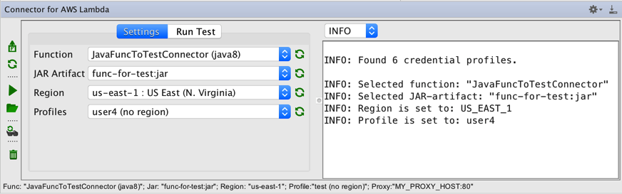
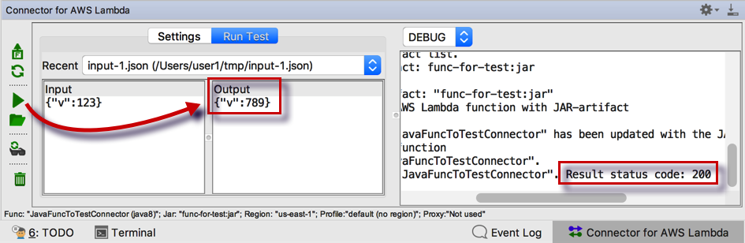
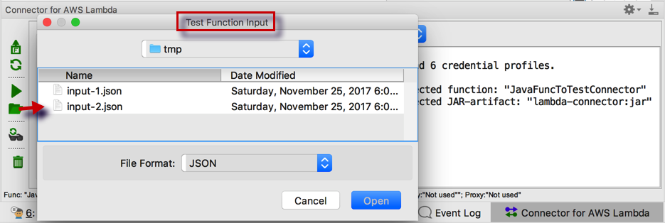

# intellij-idea-plugin-connector-for-aws-lambda
The plugin for the IntelliJ IDEA: connector for AWS Lambda functions.

View and update functions powered by AWS Lambda with JAR-artifact.

Please read more about AWS Lambda on the following site: https://aws.amazon.com/lambda

Plugin on IntelliJ site: https://plugins.jetbrains.com/plugin/9886-connector-for-aws-lambda

Latest releases and pre-releases: https://github.com/satr/intellij-idea-plugin-connector-for-aws-lambda/releases

* Install [AWS CLI](https://aws.amazon.com/cli/) and configure credentials for a user with permits to administer AWS Lambda functions. 
  * Command to create a credentials profile
  ```
  aws configure --profile YOUR-PROFILE-NAME
  ```
* Install the plugin. 
* Open a project with an AWS Lambda function. 
* Configure a JAR-artifact for the project. 
* Open the tool window  "Connector for AWS Lambda".
* Refresh  lists with AWS Lambda functions, JAR-artifacts, regions and profiles.
* Select in the list an AWS Lambda function to update it or run a test for it. 
* Update the function with the button  (do not forget first to build an updated function). 
* Type an input for a function test or load it with the button  from a json-file. 
* Hit the button  to run the test for a selected function. 
* Track activities in the Log window. Clean the log with the button 
* Set a proxy properties in the IDEA settings and setup these values in the plugin with the button 







Amazon Web Services, and AWS Lambda are trademarks of Amazon.com, Inc. or its affiliates in the United States and/or other countries.
